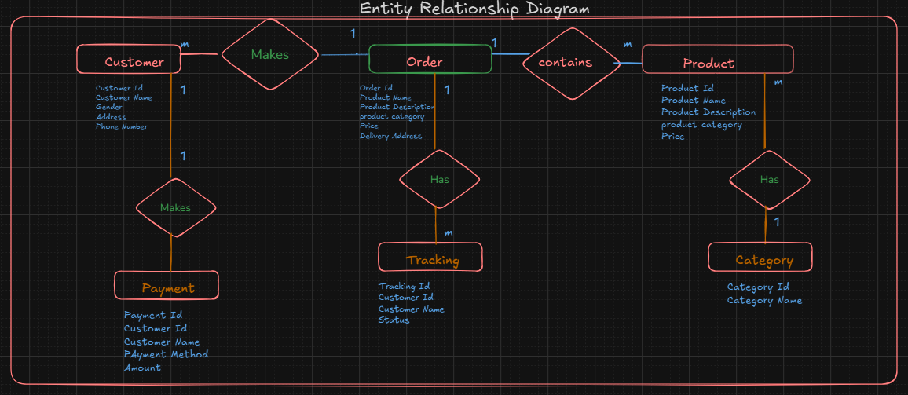

# 🏪 A-Database for E-Commerce Shop (PLP Group 400) - Cohort 7

Welcome to our **E-Commerce Shop Database** project!  
This project was developed as part of **PLP Group 400 (Cohort 7)** and focuses on creating a structured database system for an online shopping platform.

---

## 🧠 Project Overview

This database is designed to manage key aspects of an e-commerce platform, including:
- 🛍️ Product listings
- 👥 Customer accounts
- 🛒 Shopping carts and orders
- 💳 Payment records
- 🚚 Delivery and shipping information

We aimed for a clean, normalized structure that ensures data consistency, efficiency, and scalability.

---

## 📊 Entity-Relationship (ER) Diagram

Find the **Entity-Relationship Diagram** below:

  

## 📂 Database Structure
Here are the main entities and their relationships:

 

🛠️ Tools & Technologies
Database: MySQL / PostgreSQL (you can specify which one you used)

Diagramming Tool: Draw.io, Lucidchart, or Figma (specify here)

Project Management: GitHub, Trello (if applicable)

📚 How to Use
Clone this repository.

Open the provided SQL scripts.

Execute them in your local database environment.

Start inserting sample data and explore the relationships!

👨‍👩‍👧‍👦 Team Members
Daisy Cherono
Busisiwe Mabilisa
Karen Mumbi
Felix Gishu
Tracey kawa
Onyinyechi Obika
Bridget Kaneng
Charles Muthui
Milicent Nyarandi
Caleb Mbau

🚀 Future Enhancements
Add product reviews and ratings

Implement user authentication and roles

Expand payment methods (e.g., PayPal, Cryptocurrency)

Improve shipment tracking with real-time updates

📜 License
This project is licensed for educational purposes only.
Feel free to explore, learn, and adapt!
